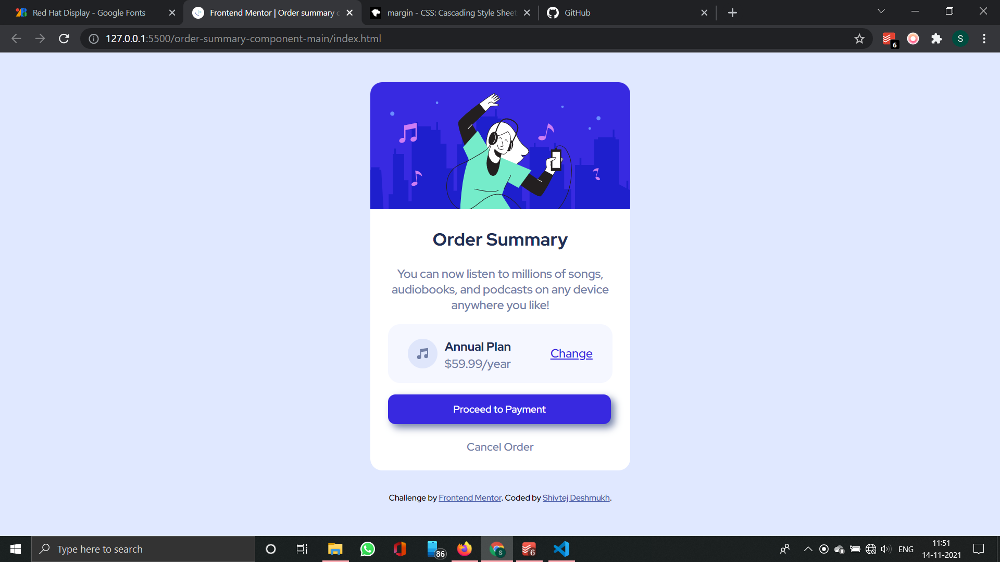

# Frontend Mentor - Order summary card solution

This is a solution to the [Order summary card challenge on Frontend Mentor](https://www.frontendmentor.io/challenges/order-summary-component-QlPmajDUj). Frontend Mentor challenges help you improve your coding skills by building realistic projects. 

## Table of contents

- [Overview](#overview)
  - [The challenge](#the-challenge)
  - [Screenshot](#screenshot)
  - [Links](#links)
- [Author](#author)

## Overview
Challenge is to build out this order summary card component and get it looking as close to the design as possible.

### The challenge

Users should be able to:

- See hover states for interactive elements

### Screenshot

### Links

- Solution URL: [solution URL](https://www.frontendmentor.io/solutions/order-summary-card-kxtrhJFlv)
- Live Site URL: [Live Site](https://shivtejordersummarycard.netlify.appa/)

### Built with

- Semantic HTML5 markup
- CSS custom properties
- Flexbox
- CSS Grid

## Author

- Website - [Shivtej Deshmukh]
- Frontend Mentor - [@Shivtej28](https://www.frontendmentor.io/profile/Shivtej28)

